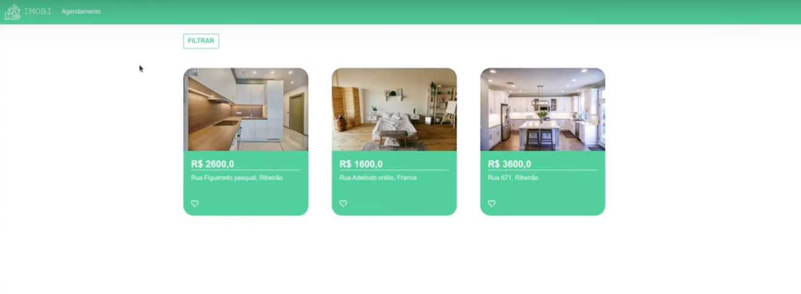
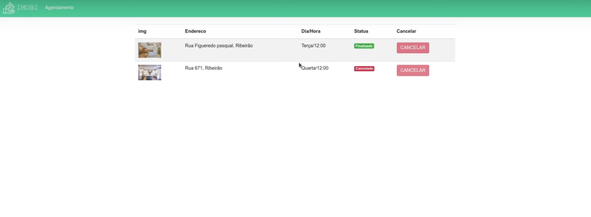

# IMOBI
Aplicativo desenvolvido na PyStack Week 2.0

## Indice
* [Instalação](#Instalação)

# Instalação
Para executar os algoritmos dese repositório recomenda-se a 
instalação dos pacotes contidos no arquivo requirements.txt

## Passos para instalar os pacotes

1. Ative seu ambiente virtual.
2. Caminhe até o diretório do arquivo requirements.txt
3. Execute o comando abaixo

```
pip install -r requirements.txt
```





